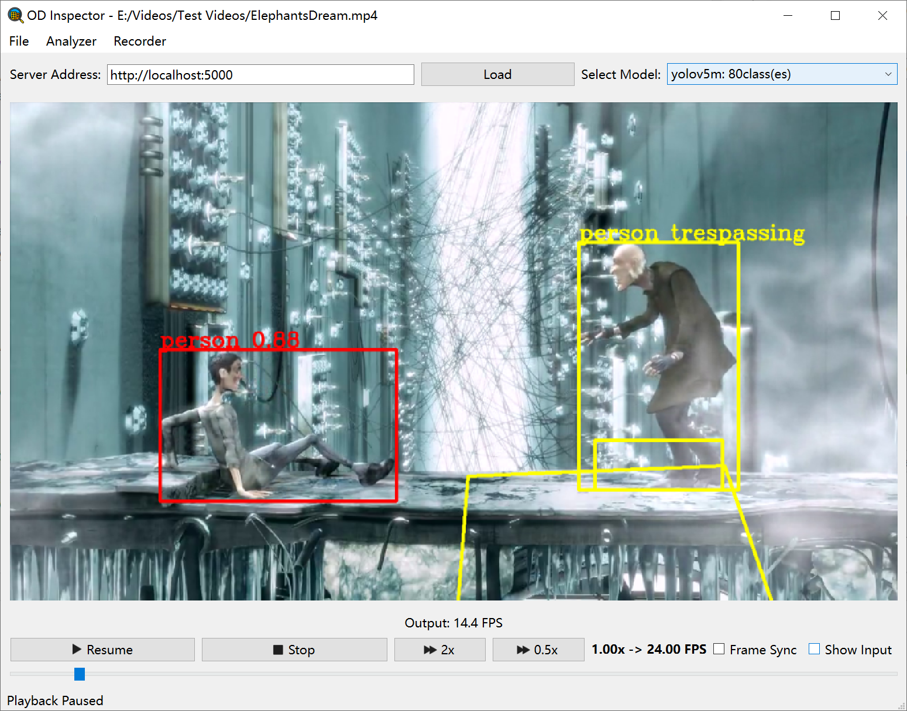

ODInspector
==========
ODInspector(ODI), short for Object Detection Inspector.
Real time video detection results viewing for object detection models.

Features
-----
1. View output frames only or paralleled with input frames.
2. Seamless model switching, no need to pause.
3. Support result analyzers such as trespassing and illegal entering.
4. Quick switch between analyzer configurations, get instant results.
5. Record any time you need with keystrokes(Ctrl+R / Ctrl+Shift+R).
6. Controllable playback speed and position with arrow key shortcut support.
7. Server and client can be implemented independently.

Screenshots
-----


Requirements
-----
Tested on python 3.9, older version might not support some
language features used in ODI api.
Package requirements see [requirements.txt](requirements.txt).

Server Implementation
-----

1. Copy package 'maverick' to your OD project.
2. (Optional) Write your configurations to `model_config.json`
```json
[
  {
    "name": "yolov7",
    "weight_path": "./model_data/yolov7_weights.pth",
    "class_path": "./model_data/coco_classes.txt"
  },
  {
    "name": "some_model",
    "weight_path": "./best_epoch_weights.pth",
    "class_path": "./my_voc_classes.txt"
  }
]
```
3. Implement ODServiceInterface
```python
from maverick.object_detection.api.v1 import ODResult, Model, ODServiceInterface

class ODService(ODServiceInterface):
    yolo_loaded: dict[str, DetectMultiBackend]

    def __init__(self):
        super().__init__()
        # optional, load model config from disk
        self.models = Model.from_json_string(open('./model_config.json').read())
        if len(self.models) == 0:
            raise FileNotFoundError("Bad config")
        self.yolo_loaded = dict()

    def do_detections(self, image: numpy.ndarray) -> list[ODResult]:
        if self.current_model is not None:
            try:
                return self.inference_with(self.yolo_loaded[self.current_model.name], image)
            except KeyError:
                logging.warning('Model might be loading...')
                return []
        logging.warning('No model selected')
        return []

    def set_current_model(self, model_name: str):
        if self.current_model is not None and model_name == self.current_model.name:
            logging.warning('No need to change model')
            return
        super().set_current_model(model_name)

        if model_name in self.yolo_loaded:
            logging.info('model already loaded')
            return

        # model loading here

        # add to record
        self.yolo_loaded[model_name] = newly_loaded_model

    @staticmethod
    def inference_with(yolo: DetectMultiBackend, img: numpy.ndarray):
        # inference
```
4. Set service and run app

```python
from maverick.object_detection import server

if __name__ == '__main__':
    server.service = ODService()
    server.app.run()
```

5. Launch ODI and enjoy.