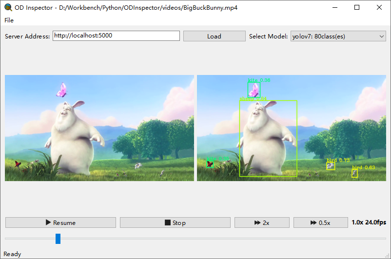

ODInspector
==========

ODInspector(ODI), short for Object Detection Inspector.
View input and output frames in parallel.
Controllable playback speed and position.
Server runs on local or remote machines,
ODI can be implemented independently.

Screenshots
-----


Server Implementation
-----

1. Copy package 'maverick' to your OD project.
2. Write your configurations to `model_config.json`
```json
[
  {
    "name": "yolov7",
    "weight_path": "./model_data/yolov7_weights.pth",
    "class_path": "./model_data/coco_classes.txt"
  },
  {
    "name": "some_model",
    "weight_path": "./best_epoch_weights.pth",
    "class_path": "./my_voc_classes.txt"
  }
]
```
3. Implement ObjectDetectionServiceInterface
```python
from maverick.object_detection.api.v1 import ObjectDetectionServiceInterface

class ODService(ObjectDetectionServiceInterface):#
    def set_current_model(self, model_name: str):
        super(ODService, self).set_current_model(model_name)
        self.yolo = None
        # load model here

    def detect(self, image):
        if self.yolo is not None:
            return # do detection here
        return []
```
4. Set service and run app

```python
from maverick.object_detection import server

if __name__ == '__main__':
    server.service = ODService()
    server.app.run()
```